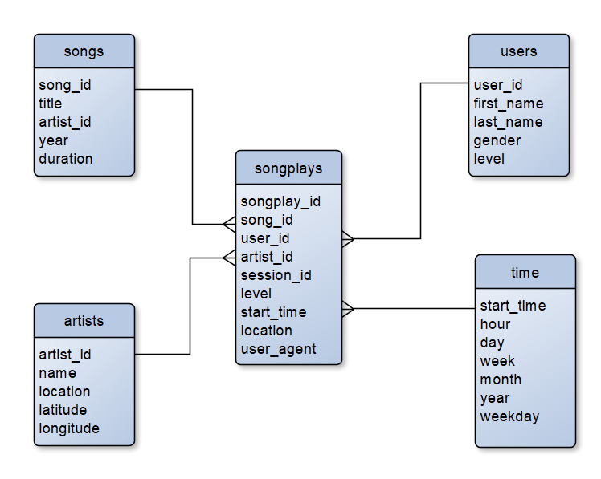

# Data-Warehouse

## Table of Contents
1. [Description](#Description)
    1. [Introduction](#Introduction)
    2. [Raw Data](#RawData)
2. [Schema Design](#SchemaDesign)
    1. [Entity Relationship Diagram](#ERD)
    2. [Fact Table](#FactTable)
    3. [Dimension Table](#DimensionTable)
3. [Getting Started](#gettingstarted)
    1. [File Description](#FileDescription)
    2. [Run Program](#RunProgram)
4. [Output](#Output)
5. [Author](#Author)
6. [Acknowledgements](#Acknowledgements)

## Description <a name="Description"></a>
This project is completed as a part of [Udacity](https://www.udacity.com/) Data Engineering Nanodegree Program.

The goal of the project is to design data warehouse for a fictitous music stream company, Sparkify and implement it in AWS cloud service

### Introduction <a name="Introduction"></a>
A startup called Sparkify wants to analyze song and user activity data on their new music streaming app and provide a personalised experience to the users. One of the examples would be building a music recommendation system based on user's preference like a favourite genre and/or artist. This will increase the quality of user experience and potentially reduce the customer churn rate. Additionally understanding the general trend of the music industry would be beneficial to the company in a way that the app service can provide the users additional recommendation according to the up-to-date music trend.   

User's music preference information can be manually specified by users in their account. However, users may not provide their specific musical taste and furthermore, this information can be easily outdated. People move on and change their style and fondness and won't bother to update this information in their account. Also, it is not easy for the company to manually catch up on what is happening in the music industry. The better approach would be to figure out what users want and what is in a trend based on the user's behaviour. What users listen tells what users want and trend.

Sparkify has been collecting songs and user activity data in their music streaming app, but currently, they don't have an easy way to query their data, which resides in AWS S3, in a directory of JSON logs on user activity on the app, as well as a directory with JSON metadata on the songs in their app. Sparkfiy needs to develop a database that is optimised for the user's song play analysis. The new database should provide analyst easy access to summary data with simple querries. For example, song play summary data by users, songs, artist, and play time should be easy to query. With such a database, Sparkify can find what songs are popular, who is the hottest singers now, who is listening to what, when, and where.

As a data engineer, I created a database schema and ETL pipeline to optimize queries on song play analysis. Data is extracted from AWS S3, staged in AWS Redshift, and transformed into a set of dimensional tables and fact table in AWS Redshift.

### Raw Data <a name="RawData"></a>
This section describes the details of raw data set which Sparkify has been collecting in their music streaming app. They currently resides in AWS S3. Here are the links for each:
- Song data: ```s3://udacity-dend/song_data```
- Log data: ```s3://udacity-dend/log_data```

Log data json path: ```s3://udacity-dend/log_json_path.json```

The following subsections are directly copied from Udacity Data Engineering Nanodegree Program/3. Cloud Data Warehouses/Project:Data Warehouse/2.Project Datasets


#### Song Dataset
The first dataset is a subset of real data from the [Million Song Dataset](http://millionsongdataset.com/). Each file is in JSON format and contains metadata about a song and the artist of that song. The files are partitioned by the first three letters of each song's track ID. For example, here are filepaths to two files in this dataset.

```
song_data/A/B/C/TRABCEI128F424C983.json
song_data/A/A/B/TRAABJL12903CDCF1A.json
```

And below is an example of what a single song file, TRAABJL12903CDCF1A.json, looks like.
```
{"num_songs": 1, "artist_id": "ARJIE2Y1187B994AB7", "artist_latitude": null, "artist_longitude": null, "artist_location": "", "artist_name": "Line Renaud", "song_id": "SOUPIRU12A6D4FA1E1", "title": "Der Kleine Dompfaff", "duration": 152.92036, "year": 0}
```
#### Log Dataset
The second dataset consists of log files in JSON format generated by this event simulator based on the songs in the dataset above. These simulate activity logs from a music streaming app based on specified configurations.

The log files in the dataset you'll be working with are partitioned by year and month. For example, here are filepaths to two files in this dataset.
```
log_data/2018/11/2018-11-12-events.json
log_data/2018/11/2018-11-13-events.json
```
And below is an example of what the data in a log file, 2018-11-12-events.json, looks like.


## Schema Design <a name="SchemaDesign"></a>
The new database is designed such that song play data can be easily analysed by song, user, artist, and time. One fact table and four dimension tables are designed as detailed below:

### Entity Relationship Diagram <a name="ERD"></a>


### Fact Table <a name="FactTable"></a>
 - songplays - records in log data associated with song plays i.e. records with page NextSong
    * Columns : songplay_id (Primary Key), start_time, user_id, level, song_id, artist_id, session_id, location, user_agent

### Dimension Tables <a name="DimensionTable"></a>
 - users - users in the app
    * Columns : user_id (Primary Key), first_name, last_name, gender, level
 - songs - songs in music database
    * Columns : song_id (Primary Key), title, artist_id, year, duration
 - artists - artists in music database
    * Columns : artist_id (Primary Key), name, location, latitude, longitude
 - time - timestamps of records in songplays broken down into specific units
    * Columns : start_time (Primary Key), hour, day, week, month, year, weekday
 
The primary keys of four dimension tables appear in the fact table as foreign keys. This allows analysts to join fact tables with dimension tables and to perform efficient queries.

During the ETL, row data is copied into the database as staging tables. Then, data for songs and artists tables are extracted from song dataset. Data for time and users are extracted from log dataset. Finally, data for songplay table is extracted from songs table, artists table and log data set. During the extraction, if duplicated primary keys are detected in user data, user's first name, last name, and level overwrite the existing record. This reflects that user may change their first name, ast name or subscription level.

## Getting Started <a name="gettingstarted"></a>
### File Description <a name="FileDescription"></a>
<pre>
- Data-Modeling-with-Postgres
|- data
|   |- log_data     # It contains users log data
|   |- song_data    # It contains song data
|- Images_For_README    # It contains image files used in README
|- create_tables.py # It drops and creates tables in the database. 
|- etl.py           # It reads and processes song and log data and loads output data into the database.
|- etl.ipynb        # development and test file for "create_tables.py" and "etl.py"
|- README           # Readme file
|- sql_credential.cfg   # It contains the sql database access credential. User is required to fill up before learning the program
|- sql_queries.py   # It ontains sql queries, and is imported by "create_tables.py" and "etl.py"
|- test.ipynb       # development test file. It can be used for testing while developing etl.ipynb 
</pre>

<!-- 
### Run Program <a name="RunProgram"></a>
1. Run a local postgres sql server and create a new database for the project.
2. Fill up the sql credential information in sql_credential.cfg.
3. Run create_tables.py
4. Run etl.py


## Output <a  name="Output"></a>
Five tables were created in the database after running the program. Below shows the first five rows for each table. Given that a fraction of entire dataset was given, songplays table has null values for most of song_id and artist_id columns
### artists ###

### songs ###

### time ###

### users ###

### songplays ###


## Author <a  name="Author"></a>
Yougun Han

## Acknowledgements <a  name="Acknowledgements"></a>
I would like to thank Udacity for designing the project. -->